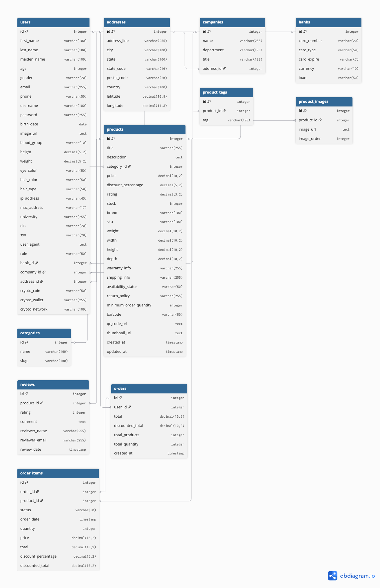
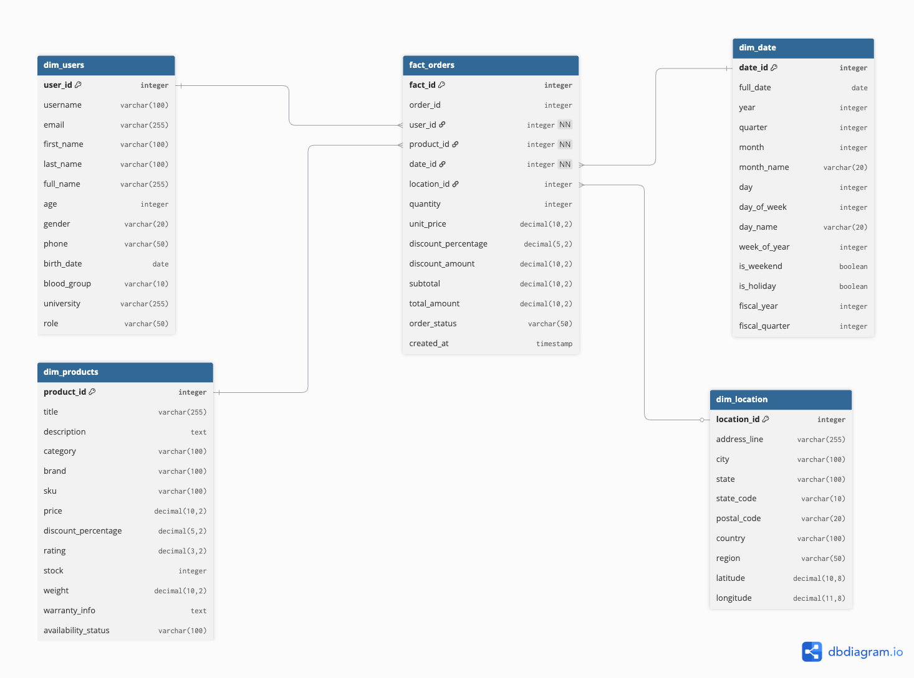
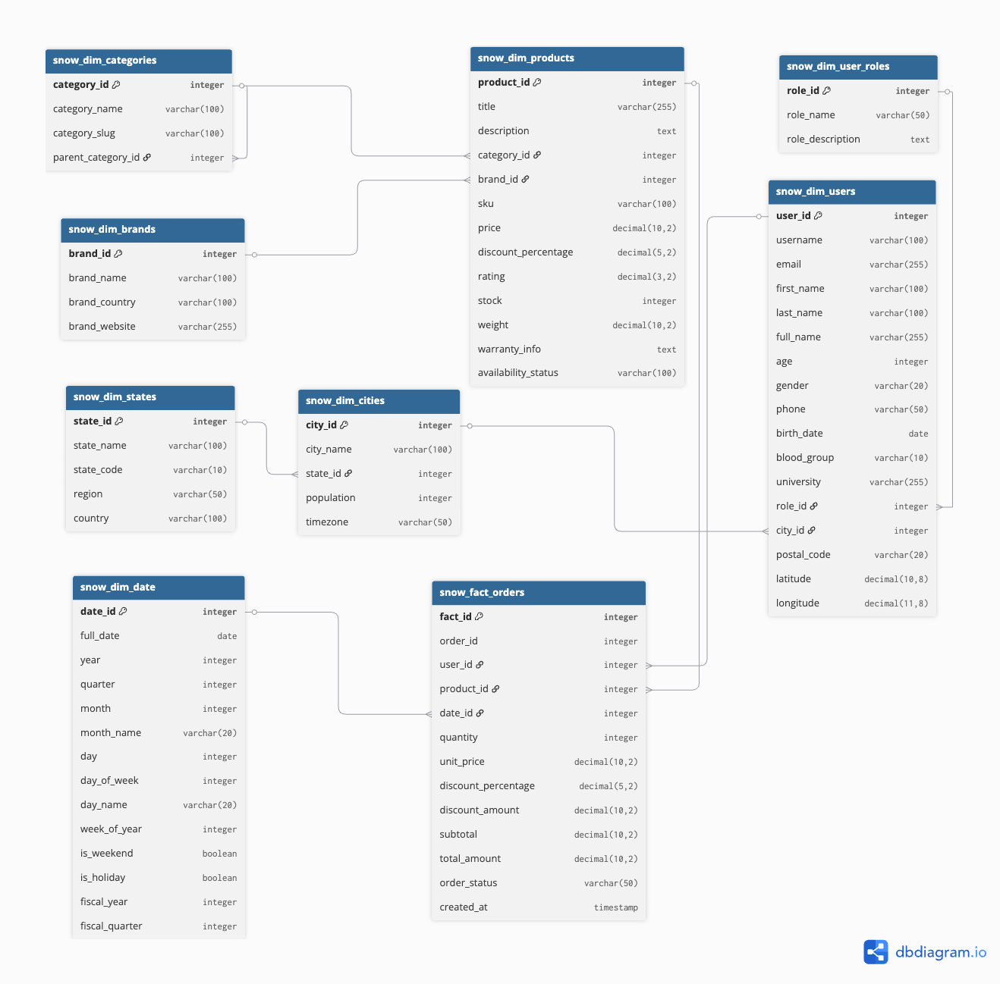

# ETL Pipeline with Multiple Storage Systems

A comprehensive ETL (Extract-Transform-Load) pipeline demonstrating data processing across different database paradigms: relational (PostgreSQL), document-oriented (MongoDB), and in-memory cache (Redis). Includes performance benchmarking of database schemas (3NF, Star, Snowflake) and file formats (CSV, JSON, Avro, Parquet).


## 🎯 Overview

This project implements a complete ETL pipeline that:
1. **Extracts** data from the DummyJSON API (products, users, orders)
2. **Transforms** data into normalized (3NF) format
3. **Loads** data into three different storage systems:
   - PostgreSQL (3NF, Star Schema, Snowflake Schema)
   - MongoDB (denormalized documents)
   - Redis (caching layer)

The project includes comprehensive benchmarks comparing:
- Insert/read performance across databases
- File format efficiency (CSV, JSON, Avro, Parquet)
- Query performance across different schema designs

## ✨ Features

### ETL Pipeline
- ✅ Data extraction from REST API
- ✅ Normalization to Third Normal Form (3NF)
- ✅ Multi-target loading (PostgreSQL, MongoDB, Redis)
- ✅ Automatic data type conversion and validation

### Database Schemas
- ✅ **3NF Schema** — Fully normalized relational model
- ✅ **Star Schema** — Dimensional model for analytics
- ✅ **Snowflake Schema** — Normalized dimensional model
- ✅ Auto-generated date dimension (2020-2026)

### File Format Support
- ✅ CSV reading/writing with type inference
- ✅ JSON with streaming support (JSONL)
- ✅ Avro with schema auto-generation
- ✅ Parquet with multiple compression options

### Benchmarking
- ✅ Insert performance (single vs batch)
- ✅ Read performance comparison
- ✅ Query performance across schemas
- ✅ File format size and speed analysis

### Bonus Features
- ✅ Docker Compose setup with pgAdmin & Redis Commander
- ✅ Fact table export to Parquet/JSON
- ✅ Comprehensive validation tests
- ✅ Performance monitoring and logging

## 🏗️ Architecture

```
┌─────────────┐
│ DummyJSON   │
│     API     │
└──────┬──────┘
       │ Extract
       ▼
┌─────────────┐
│  Transform  │
│    (3NF)    │
└──────┬──────┘
       │ Load
       ├────────────────┬─────────────┐
       ▼                ▼             ▼
┌─────────────┐  ┌──────────┐  ┌─────────┐
│ PostgreSQL  │  │ MongoDB  │  │  Redis  │
│  - 3NF      │  │ Documents│  │  Cache  │
│  - Star     │  └──────────┘  └─────────┘
│  - Snowflake│
└─────────────┘
```

## 📦 Prerequisites

- **Python 3.11+**
- **Docker & Docker Compose** (recommended)
- **Git**

### Without Docker:
- PostgreSQL 15+
- MongoDB 7.0+
- Redis 7.0+

## 🚀 Installation

### 1. Clone the Repository

```bash
git clone https://github.com/k-zozulia/data_hw_2.git
cd data_hw_2
```

### 2. Install Python Dependencies

```bash
pip install -r requirements.txt
```

### 3. Start Database Services

### Option A: Using Docker (Recommended)

```bash
# 1. Clone repository
git clone https://github.com/k-zozulia/data_hw_2.git
cd data_hw_2

# 2. Install Python dependencies
pip install -r requirements.txt

# 3. Start database services
docker-compose up -d

# 4. Wait for services to be healthy (~30 seconds)
docker-compose ps

# 5. Run ETL pipeline
python pipeline.py

# 6. Run benchmarks
python benchmark/benchmark_databases.py
python benchmark/benchmark_formats.py
python benchmark/benchmark_schemas.py

# 7. Validate data
python validate/data_validator.py
```

### Option B: Manual Setup

```bash
# 1. Install databases manually
# - PostgreSQL 15+
# - MongoDB 7.0+
# - Redis 7.0+

# 2. Update configs/config.py with your connection details

# 3. Follow steps 2, 5-7 from Option A
```

---


## 💻 Usage

### Full ETL Pipeline

Run the complete pipeline (Extract → Transform → Load):

```bash
python pipeline.py
```

This will:
1. Extract data from DummyJSON API
2. Normalize to 3NF
3. Load into PostgreSQL (3NF, Star, Snowflake)
4. Load into MongoDB (denormalized)
5. Cache in Redis

### Individual Modules

#### Extract Only
```bash
python extract/extract.py
```

#### Transform Only
```bash
python transform/transform.py
```

#### Load to Specific Database
```bash
python load/load_postgres.py       # 3NF
python load/load_star_schema.py    # Star Schema
python load/load_snowflake_schema.py  # Snowflake Schema
python load/load_mongo.py          # MongoDB
python load/load_redis.py          # Redis
```

### Run Benchmarks

```bash
# Database performance
python benchmark/benchmark_databases.py

# File format comparison
python benchmark/benchmark_formats.py

# Schema query performance
python benchmark/benchmark_schemas.py
```

### Generate Test Data

```bash
python generate/test_data_generator.py
```

Generates 10,000 test records for performance testing.


### Data Validation

```bash
python validate/data_validator.py
```
Validate data in files and Postgres db.


### Export Fact Tables

```bash
python export/export_fact_tables.py
```

Exports fact tables to Parquet and JSON formats.

## 📁 Project Structure

```
etl-project/
├── README.md                     # This file
├── RESULTS.md                    # Benchmark results & conclusions
├── requirements.txt              # Python dependencies
├── docker-compose.yml            # Docker services configuration
├── .gitignore                    # Git ignore rules
│
├── configs/
│   └── config.py                 # Database & API configuration
│
├── utils/
│   └── logger.py                 # Centralized logging
│
├── extract/
│   └── extract.py                # Data extraction from API
│
├── transform/
│   └── transform.py              # Data normalization (3NF)
│
├── load/
│   ├── load_postgres.py          # Load 3NF to PostgreSQL
│   ├── load_star_schema.py       # Load Star Schema
│   ├── load_snowflake_schema.py  # Load Snowflake Schema
│   ├── load_mongo.py             # Load to MongoDB
│   └── load_redis.py             # Cache in Redis
│
├── handlers/                     # File format handlers
│   ├── base_handler.py           # Abstract base class
│   ├── csv_handler.py            # CSV operations
│   ├── json_handler.py           # JSON/JSONL operations
│   ├── avro_handler.py           # Avro with schema inference
│   └── parquet_handler.py        # Parquet with compression
│
├── benchmark/                    # Performance benchmarks
│   ├── benchmark_databases.py    # DB insert/read comparison
│   ├── benchmark_formats.py      # File format comparison
│   └── benchmark_schemas.py      # Schema query performance
│
├── validate/
│   └── data_validator.py         # Data validation & integrity
│
├── export/
│   └── export_fact_tables.py     # Export fact tables
│
├── generate/
│   └── test_data_generator.py    # Generate test data
│
│
├── sql/                          # SQL schemas & queries
│   ├── create_tables_3nf.sql
│   ├── create_tables_star.sql
│   ├── create_tables_snowflake.sql
│   ├── queries_3nf.sql
│   ├── queries_star.sql
│   └── queries_snowflake.sql
│
├── results/                      # Benchmark results
│   ├── db_benchmark.txt
│   ├── format_benchmark.txt
│   ├── schema_benchmark.txt
│   └── pipeline.txt
│
├── data/                         # Data files
│   ├── raw/                      # Extracted raw data
│   ├── processed/                # Normalized data
│   ├── test/                     # Test datasets
│   └── exports/                  # Exported fact tables
│
└── pipeline.py                   # Main ETL orchestrator
```

## 🗄️ Database Schemas

### 3NF (Third Normal Form)

Fully normalized relational schema with 11 tables:

**Core Entities:**
- `users` — User profiles
- `products` — Product catalog
- `orders` — Customer orders

**Supporting Tables:**
- `addresses` — Physical addresses
- `banks` — Payment information
- `companies` — Company data
- `categories` — Product categories
- `order_items` — Order line items
- `reviews` — Product reviews
- `product_tags` — Product tags
- `product_images` — Product images

**ERD Diagram:** 



### Star Schema

Dimensional model optimized for analytics (5 tables):

**Fact Table:**
- `star_fact_orders` — Transaction facts with metrics

**Dimension Tables:**
- `star_dim_users` — User dimension
- `star_dim_products` — Product dimension (denormalized)
- `star_dim_date` — Date dimension (pre-generated)
- `star_dim_location` — Geographic dimension

**ERD Diagram:** 



**Advantages:**
- Fast aggregations (fewer JOINs)
- Simple query structure
- Optimized for BI tools

### Snowflake Schema

Normalized dimensional model (9 tables):

**Fact Table:**
- `snow_fact_orders`

**Main Dimensions:**
- `snow_dim_users` (references sub-dimensions)
- `snow_dim_products` (references sub-dimensions)
- `snow_dim_date`

**Sub-Dimensions:**
- `snow_dim_user_roles`
- `snow_dim_categories`
- `snow_dim_brands`
- `snow_dim_states`
- `snow_dim_cities`

**ERD Diagram:**



**Advantages:**
- Reduced redundancy
- Easier maintenance
- Better for hierarchical data

## 📊 Performance Results

### Database Comparison

| Operation | PostgreSQL | MongoDB | Redis | Winner |
|-----------|------------|---------|-------|--------|
| Insert 10k records | 0.127s | 0.088s | 0.081s | 🏆 Redis |
| Read single item | 0.14ms | 0.18ms | 0.10ms | 🏆 Redis |
| Read filtered set | 0.29ms | 0.43ms | N/A | 🏆 PostgreSQL |

**Batch insert is 9.9x faster than single insert in PostgreSQL.**

### File Format Comparison

| Format | Size (MB) | Read (s) | Write (s) | Best For |
|--------|-----------|----------|-----------|----------|
| CSV | 4.41 | 0.231 | 0.078 | Human-readable |
| JSON | 9.99 | **0.029** | 0.125 | APIs, web |
| Avro | 4.26 | 0.074 | **0.068** | Streaming |
| Parquet | **0.48** | 0.113 | 0.260 | Analytics |

**Parquet achieves 10.4:1 compression ratio.**

### Schema Query Performance

| Schema | Avg Query Time | Performance vs 3NF |
|--------|----------------|---------------------|
| 3NF | 0.0013s | Baseline |
| Star | **0.0008s** | **38% faster** 🏆 |
| Snowflake | 0.0009s | 31% faster |

**Star Schema is fastest for OLAP queries due to denormalized dimensions.**

*Full results and analysis in [RESULTS.md](RESULTS.md)*

## 🛠️ Technologies

### Backend
- **Python 3.11+** — Main programming language
- **psycopg2** — PostgreSQL adapter
- **pymongo** — MongoDB driver
- **redis-py** — Redis client

### Data Processing
- **pandas** — Data manipulation
- **pyarrow** — Parquet support
- **fastavro** — Avro serialization
- **requests** — API calls

### Databases
- **PostgreSQL 15** — Relational database
- **MongoDB 7.0** — Document database
- **Redis 7.0** — In-memory cache

### DevOps
- **Docker & Docker Compose** — Containerization
- **pgAdmin 4** — PostgreSQL GUI
- **Redis Commander** — Redis GUI